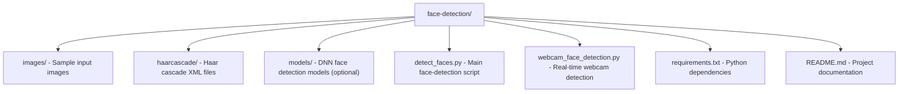

# face_detection
# 👤 Face Detection Project

This project is a simple yet powerful **Face Detection** system built using Python and OpenCV. It detects human faces in real time from a webcam feed or from static images.

## 🚀 Features

- Detect faces in images and webcam video streams  
- Supports both Haar Cascade and DNN (Deep Neural Network) face detectors  
- Real‑time performance with OpenCV  
- Clean, modular code that’s easy to extend  

---

## 📂 Project Structure



### 2. (Recommended) Create a virtual environment

```bash
python -m venv venv

# For macOS / Linux
source venv/bin/activate

# For Windows
venv\Scripts\activate
```

### 3. Install dependencies
```bash
Copy
Edit
pip install -r requirements.txt
```

## 🧠 Requirements

### Core Dependencies

| Package         | Purpose                  | Minimum Version |
|----------------|--------------------------|-----------------|
| Python          | Language runtime         | 3.7+            |
| opencv-python   | Core OpenCV functions    | latest          |
| numpy           | Array operations         | latest          |

### Optional (for DNN face detector)

| Package               | Purpose                             |
|-----------------------|-------------------------------------|
| opencv-contrib-python | Includes extra modules for DNN      |
| Pre-trained model files | `deploy.prototxt` and `res10_300x300_ssd_iter_140000.caffemodel` |

## 📸 Usage

### 🔍 Detect faces in a static image

```bash
python detect_faces.py --image images/sample.jpg
```

### 🎥 Real‑time face detection from webcam

```bash
python webcam_face_detection.py
```
## 🧪 Sample Output


- ✅ Bounding boxes drawn around detected faces  
- ✅ Option to save the annotated image or video frames


## 🧰 Roadmap / TODO

- [ ] Add face‑mask detection  
- [ ] Implement face blurring for privacy  
- [ ] Integrate facial landmark detection (Dlib or MediaPipe)


## 📬 Contact & Demo

- 🔗 **LinkedIn**: [Your Name](https://www.linkedin.com/in/your-profile/)  
- 📧 **Gmail**: [yourname@gmail.com](mailto:yourname@gmail.com)  
- ▶️ **Demo Video on YouTube**: [Watch here](https://www.youtube.com/watch?v=JZZr0PjZsIk)

[🔗 View on GitHub](https://github.com/ageitgey/face_recognition)
<p align="center">
  <a href="https://github.com/ageitgey/face_recognition" target="_blank">
    
  </a>
</p>

